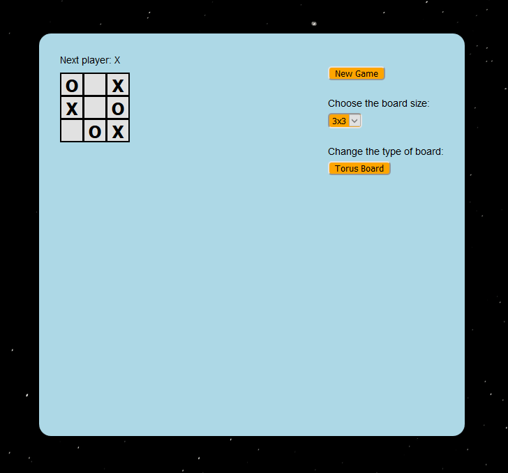
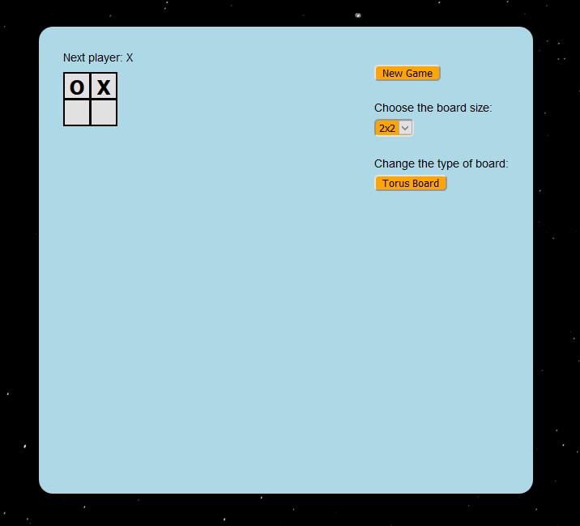
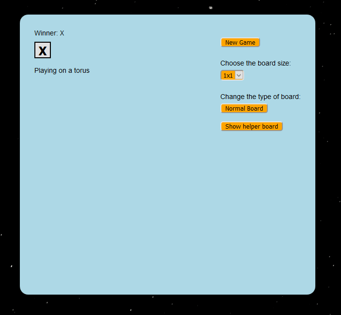
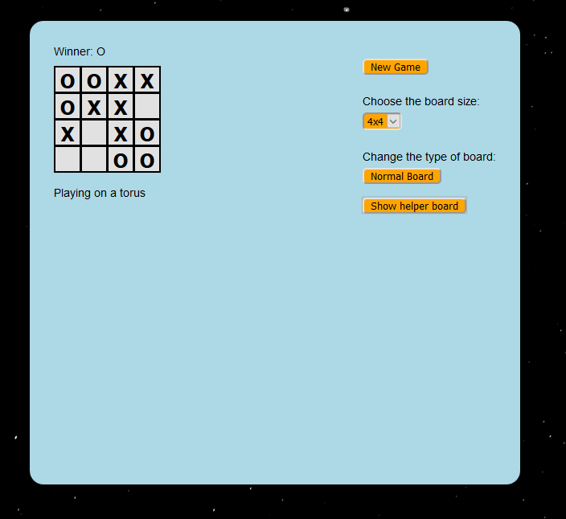
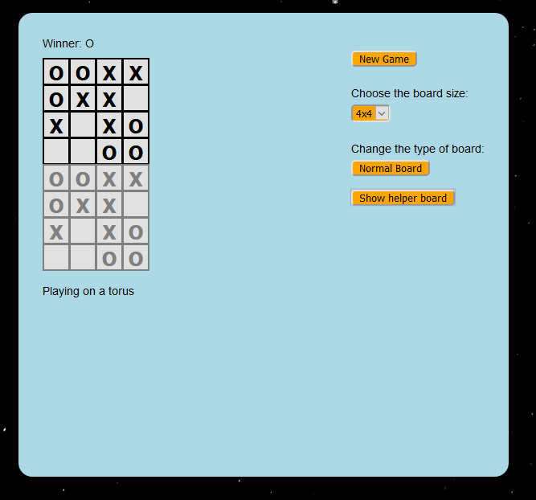

## React tic-tac-toe improved 

This app builds on the React tic-tac-toe tutorial app by adding the following functionality:

- Ability to re-size the board to any size from 0x0 to 9x9.
- For each board size, the app can tell if a game was won or tied.
- O automatically plays using a basic strategy, and will block your moves!
- You can use either a normal board, or play on a torus. Playing on a torus meansopposite sides of the board are identified. There is the option to show a helper board to help visualize winning moves on the torus board. 

Here is a link to the app: [Tic-tac-toe app](https://pecan-pine.github.io/react-tic-tac-toe-improved/)

Basic gameplay: 

With a 2x2 board, there is not very much strategy: 

With a 0x0 or 1x1 board, there is even less strategy: 

Here is a winning game for O on a torus: 

The helper board shows O has 4 in a row diagonally: 

### Improvements:

Some things I think could use improvement in the app:

- Currently O's strategy is fairly predictable. It is not too hard to win, except maybe playing on a torus without the helper board.

I hope you enjoy this app! I had fun making it. 
